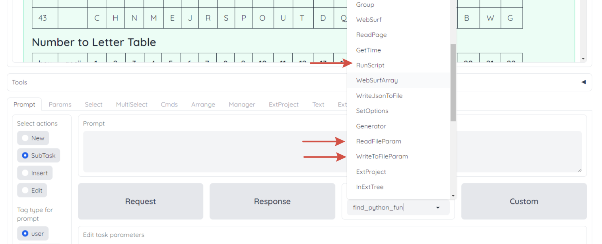

# GenSlides

GenSlides is an innovative program designed to offer a user-friendly interface for interacting with language learning models (LLMs) like GPT-4. Instead of manually inputting data into the LLM and waiting for results, GenSlides streamlines the process through an intuitive dialog tree structure, where each branch is an independent dialog.
- [на русском)](./README.ru.md)


## Quick Start

To quickly set up GenSlides, follow these steps:

1. Create a virtual environment and activate it:

   For window user:
    ```shell
    python -m venv .env
    .env\Scripts\Activate.ps1
    ```
 
   For Linux user:
    ```shell
    python3 -m venv .env
    source .env/bin/activate
    ```
1.1 Maybe you have to install:
```shell
sudo apt-get install python3.12-venv
```
change 3.12 on your version

2. Install the necessary dependencies:
    ```shell
    python -m pip install -r requirements.txt
    python -m nltk.downloader popular
    ```
2.1 Install tkinter for your version of python

   ```shell
   sudo apt-get install python3-tk
   ```
2.2 If error: ModuleNotFoundError: No module named 'distutils'

```shell
   python -m pip install setuptools
```

3. Install Graphviz:

   - Windows: Download and install from [Graphviz Download Page](https://www.graphviz.org/download/)
   - Ubuntu: Run 
   ```shell
   sudo apt-get install graphviz
   ```

4. Obtain your API keys:
   - OpenAI API: Obtain from [OpenAI API Keys](https://platform.openai.com/account/api-keys)
   - Google API: Follow the quickstart guide at [Google Docs API](https://developers.google.com/docs/api/quickstart/python)

5. Set up your API configuration:
   - Copy the `config` folder from the examples to the root directory.
   - Input your API keys into `google.json` and `openai.json`.

6. Finally, run the following command to start GenSlides:
    ```shell
    python -m genslides
    ```

## How to Update

For developers looking to update requirements or install new libraries, use:

```shell
python -m pip freeze > requirements.txt
python -m pip install target_lib
```

## Limitations

Please note that GenSlides is currently a prototype. Always report any errors you encounter and monitor your OpenAI API usage to avoid exceeding limits.

## Program Functionality

GenSlides provides the following features:

- Start session:
- Set session name and push Button `New session name`
- Create folder to project: [path to example ]/example/base/project
  - Path [path to example ]/example/tt_temp/ will be used for temporary file
- Push Button `Load action to location` and select path to subdir project

- Create dialogs with user requests and LLM responses.
  - Use `Select action` to add new task to chain or edit task prompt
  - Task Request for user input
  - Task Response for LLM output

  - Modify messages within dialogs.


- Navigate on tree
  - Here below list of navigation button, except `Create Tree`


- Update tree to llm responses


- Select which LLM model to use.


- Execute Python scripts and share your dialogs or dialog sets.
- File reading and writing capabilities.


- Initiate new dialogs with portions of existing conversations.
- Merge different dialogs for comprehensive information.
- Implement Automated Thought-Branch Transfer for replicating data branches.
- Facilitate Automated Inter-Tree Data Mirroring across different thought trees.
- Record the history of changes to dialogs.

## Usage Examples

Here are some ways you can utilize GenSlides:

- Engage in step-by-step learning on various themes.
- Decompose problems and explore multiple solutions.
- Automate code generation and testing processes.
- Collect datasets from your thought chains for later use.
- Create automatic instructions and discover additional steps needed.
- Use sequential summarization to analyze tasks and improve comprehension.
- Test and iterate on scripts until the desired outcome is achieved.

## Roadmap

The following upcoming changes are scheduled for development:

Please, check Issues

## License

GenSlides is released under the MIT License.

## Contact Information

For any inquiries, feel free to email us at exactosim@gmail.com.

## FAQ

**Q: How to disable debugging?**
A: Set the "active" flag in openai.json to "false" to prevent requests from being sent via OpenAI API.

**Q: Where can I find example projects?**
A: Check out the `examples` directory for project samples, and remember to copy them to the root for exploration.

For a visual guide, watch the explanatory video below:

[](http://www.youtube.com/watch?v=tOZpFCOcqNA)

---

Genslides, proposing a new way to enhance your dialogue with AI.