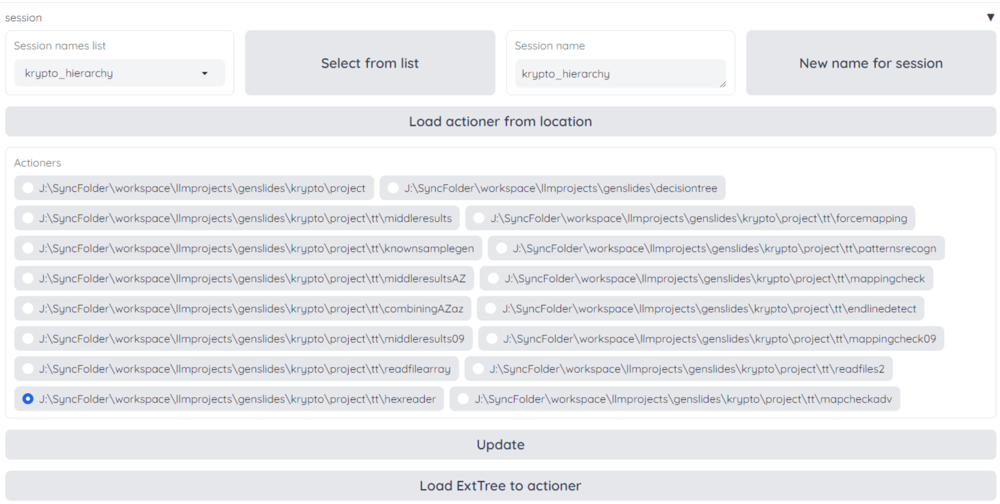
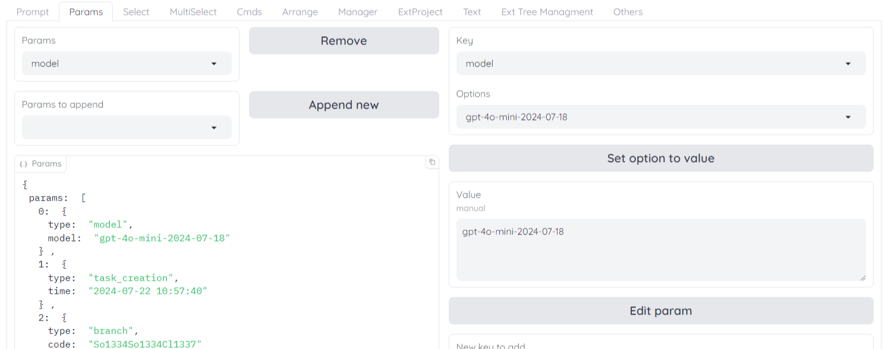

# GenSlides

GenSlides - это инновационная программа, разработанная для создания удобного интерфейса для взаимодействия с Большими Языковыми Моделями (LLM), такими как GPT-4. Вместо того чтобы вручную вводить данные в LLM и ждать результатов, GenSlides упрощает этот процесс с помощью интуитивно понятной структуры дерева диалогов, где каждая ветвь является независимым диалогом.

# Быстрый старт

Чтобы быстро настроить GenSlides, выполните следующие действия:

1. Создайте виртуальную среду и активируйте ее:

   Для пользователя windows:
```shell
    python -m venv .env
    .env\Scripts\Activate.ps1
```
 
   Для пользователя Linux:
```shell
    python3 -m venv .env
    source .env/bin/activate
```
1.1 Возможно, вам придется установить:

```shell
sudo apt-get install python3.12-venv
```
замените 3.12 на вашу версию

2. Установите необходимые зависимости:
```shell
    python -m pip install -r requirements.txt
    python -m nltk.downloader popular
```
2.1 Установите tkinter для вашей версии python

```shell
   sudo apt-get install python3-tk
```
2.2 Если ошибка: ModuleNotFoundError: No module named 'distutils', то 

```shell
   python -m pip install setuptools
```

3. Установите Graphviz:

   - Windows: Скачайте и установите с [Graphviz Download Page](https://www.graphviz.org/download/).
   - Ubuntu: Запустите 
```shell
   sudo apt-get install graphviz
```

4. Получите ключи API:
   - API OpenAI: Получить из [OpenAI API Keys](https://platform.openai.com/account/api-keys).
   - Google API: Следуйте руководству по быстрому запуску на [Google Docs API](https://developers.google.com/docs/api/quickstart/python).

5. Настройте конфигурацию API:
   - Скопируйте папку `config` из примеров в корневой каталог.
   - Введите ключи API в файлы `google.json` и `openai.json`.

6. Наконец, выполните следующую команду для запуска GenSlides:
```shell
    python -m genslides
```

## Ограничения

Обратите внимание, что GenSlides в настоящее время является прототипом. Всегда сообщайте о любых возникающих ошибках и следите за использованием API OpenAI, чтобы избежать превышения лимитов.

## Функциональность программы

GenSlides предоставляет следующие возможности:

- Запуск сессии:
- Задайте имя сессии и нажмите кнопку `Новое имя сессии`.
- Создайте папку для проекта: [путь к примеру ]/example/base/project
  - Путь [путь к примеру ]/example/tt_temp/ будет использоваться для временного файла
- Нажмите кнопку `Загрузить действие в местоположение` и выберите путь к поддиректории проекта



- Создавайте диалоги из запросов пользователя и ответов ассистента
  - Используйте `Select action` для добавления новой задачи с промптом
  - Задачи Request используйте для пользовательского ввода
  - Задачи Response для ответов ассистента LLM

- Модифицируйте промпты уже созданных задач


- Перемещайтесь по дереву размышлений
  - Список навигационных эелементов на рисукнке ниже


- Обновите деревья после введенных изменений


- Выбирайте LLM модели для использования


- Запускайте скрипты и заново используйте сообщения в диалогах
- Возможности чтения и записи файлов


- Запускайте новые диалоги, используя фрагменты существующих разговоров.
- Объединяйте различные диалоги для получения полной информации.
- Реализуйте автоматический перенос ветвей размышлений для репликации ветвей.
- Автоматизированное зеркальное отображение данных между различными деревьями размышлений.
- Ведите запись истории изменений в диалогах.

## Примеры использования

Вот некоторые способы использования GenSlides:

- Пошаговое обучение по различным темам.
- Декомпозиция проблем и поиск различных решений.
- Автоматизирование процессов генерации и тестирования кода.
- Сбор данных из цепочек размышлений для последующего использования.
- Создавайте автоматические инструкции и находите необходимые вспомогательные цпочки размышлений.
- Используйте последовательное обобщение для анализа задач и улучшения их понимания.
- Тестируйте и повторяйте различные сценарии до достижения желаемого результата.

## Дорожная карта

Следующие изменения запланированы к разработке:

Пожалуйста, проверьте вопросы

## Лицензия

GenSlides выпускается под лицензией MIT.

## Контактная информация

For any inquiries, feel free to email us at artem.o.kuznecov@gmail.com.

