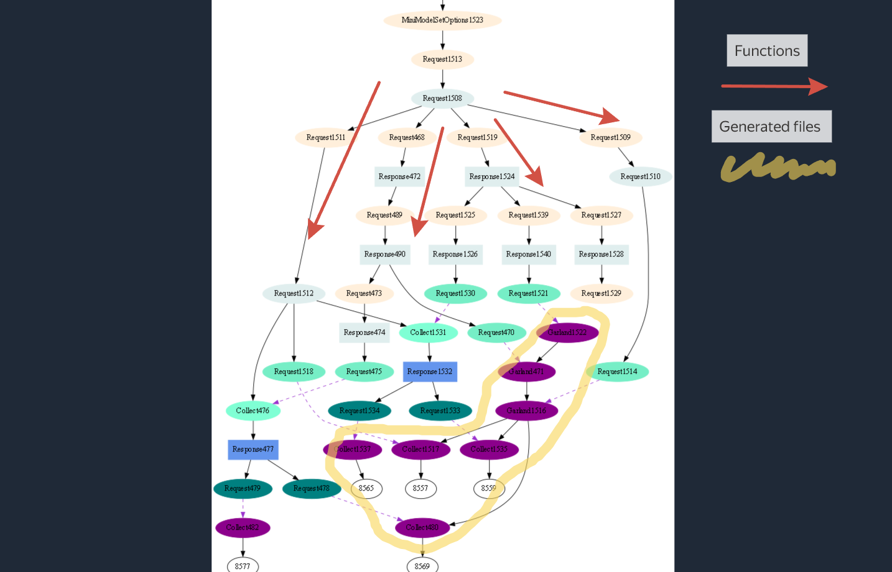

# Democratizing Software Development with Natural Language

The main goal of this project is to democratize software development by enabling the creation of fully functional programs using **natural language**.  This eliminates the need to write or even see code in traditional programming languages like Python, Java, or C++, making software development accessible to everyone, regardless of their coding expertise.  This empowers non-technical users to express their software ideas and needs directly in a language they understand. Users won't require any programming knowledge or even have to interact with the underlying source code; the system handles all technical details behind the scenes.

## The Problem

Currently, creating and maintaining software requires deep knowledge of programming languages and specialized libraries, which are often outdated and inaccessible for education (legacy code). This expertise requirement excludes a vast majority of people and makes software development costly and time-consuming.

## Our Solution

Our approach uses interactive blocks, like a construction set, to simplify development.  Users connect these blocks visually, describing the desired functionality.

* **Visual Programming:**  Imagine all necessary tools transformed into a set of interactive blocks. You connect these blocks, defining the functionality of your software by specifying the actions each block performs.

* **LLM-Powered Code Generation:** An LLM interprets the block connections and generates the underlying code, automating the translation of the user's design into a working program.

* **Self-Documenting System:** Each block contains an instruction, and these instructions become the ready-made documentation. This ensures the documentation is inherently linked to the application's functionality, making it clear, concise, and always up-to-date.  Because the program is created using simple instructions, those same instructions explain how it works, simplifying understanding and maintenance. This eliminates the gap between code and documentation common in traditional development.

* **Graphical Dialogues for Libraries:** We transform libraries into graphical dialogues—instructions linked to code. These dialogues provide a visual and interactive way to access and use library functionalities.

* **Automatic Synchronization:** The system automatically keeps instructions and the program in sync. Any changes to the instructions are instantly reflected in the program, ensuring constant synchronization and up-to-date documentation. This dynamic updating keeps the documentation aligned with the software's actual functionality.

## Empowering Domain Experts

This approach allows specialists from various fields (physicists, medical professionals, construction workers) to create their own tools using their professional knowledge. They can leverage their domain expertise to create software tailored to their specific needs *without* requiring programming skills.

## Another style of Programming

The core concept of Genslides stems from a story about Africans using smartphones for programming. This inspired the design of a mobile-first programming UI.  Smartphone programming presents unique challenges:

* **Typing Difficulty:** Unusual words are harder to type.
* **Obstructed View:**  The interface often covers parts of the screen.
* **Block Text Handling:** Text is frequently manipulated in blocks.
* **Touch-Based Interaction:**  Heavy reliance on touch gestures.

On a PC, the keyboard and screen are separate entities, with text treated as a large canvas. This fundamental difference in interaction between smartphones and PCs necessitates distinct text editing approaches, tools, and techniques.  Constant scrolling on a small smartphone screen is cumbersome for lengthy texts. A hierarchical, tree-like structure, where navigation occurs between sections, offers a far superior user experience.

Code organization—files containing classes, which in turn contain functions—perfectly embodies this hierarchical structure.  This tree-like structure is ideal for programming because it mirrors the natural hierarchy of code:

* **File**
* **Class**
* **Function**

This hierarchy simplifies understanding and navigation within complex codebases.  Leveraging Large Language Models (LLMs) allows for:

* **Tracking Connections:**  Understanding relationships between different parts of the text.
* **Automated Changes:**  Making necessary and consistent changes across the program. For example, renaming a variable used in multiple blocks becomes significantly easier when LLMs understand the relationships between code blocks within a tree structure.

## Example of program structure

