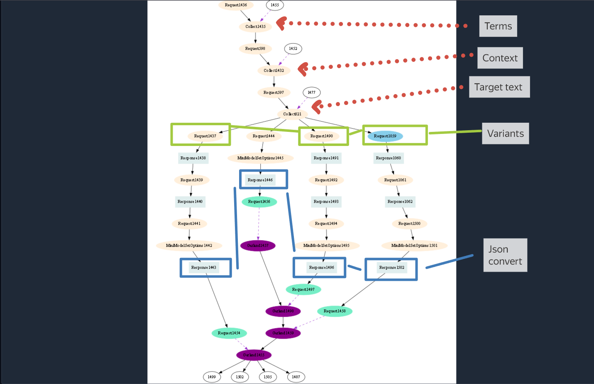

## High-Quality Translation: Beyond Google Translate

Translating an article into another language demands more than just language proficiency.  Even fluent speakers need patience and significant time due to the sheer volume of text requiring careful refinement.

While Google Translate can be helpful in such situations, its limited functionality can impact the final quality, especially when encountering unknown terms or specialized vocabulary.  Consider these challenges:

* **Field-specific terminology:**  The word "tree" has distinct meanings in biology versus programming.
* **Code translation:**  Often, only the comments within code need translation.

Large Language Models (LLMs) offer a powerful alternative to Google Translate by allowing for nuanced instructions and customization:

* **Targeted Terminology:** You can specify exact translations for specific terms.
* **Selective Translation:**  Ignore specific words or phrases like proper names or technical notations.
* **Style Control:** Configure the LLM to use a specific writing style (e.g., formal or informal) to adapt the translation to the target audience.
* **Contextual Understanding:** LLMs are often better at understanding context, leading to more accurate translations, especially in complex sentences or with ambiguous terms.

This enhanced control makes LLMs a valuable tool for producing high-quality translations that meet specific needs.



Variants:

```
Do the following for each sentence:

Describe the structure of the sentence.
Assess the difficulty of perceiving the structure.
Explain your assessment of the complexity.
Response format:

[ sentence]: used [structure], perceptual complexity: [complexity]. They arise: [explanation of assessment].
...
```

```
Do the following for each sentence:

Find words, highly specialized terms for a person unfamiliar with programming.
Evaluate their comprehensibility.
Make an explanation of the comprehensibility assessment.
Answer format:

[Sentence]: used [terms], understandability: [understandability assessment]. This assessment is given because of [Explanation].
...
```

```
For each sentence of the Text:

Find Terms.
Highlight key moments.
Response format:

[Sentence]: using [Terms]. There are [key moments].
...
```


